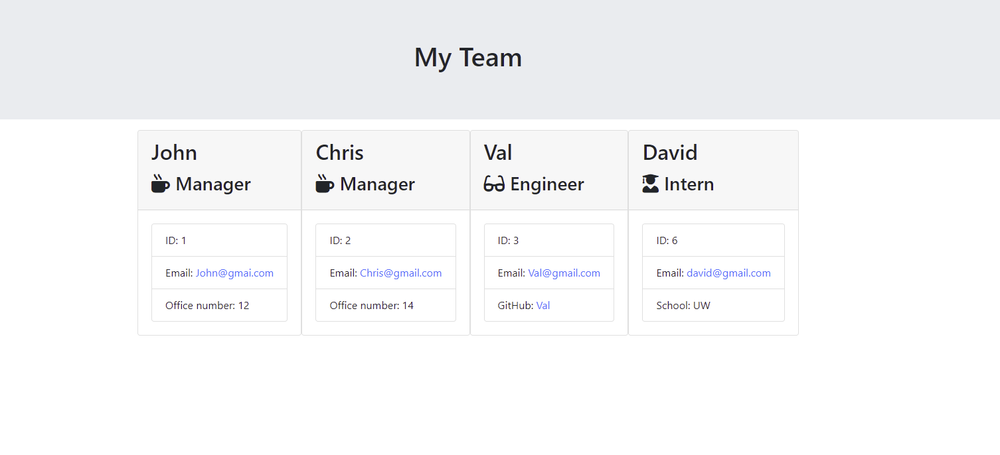
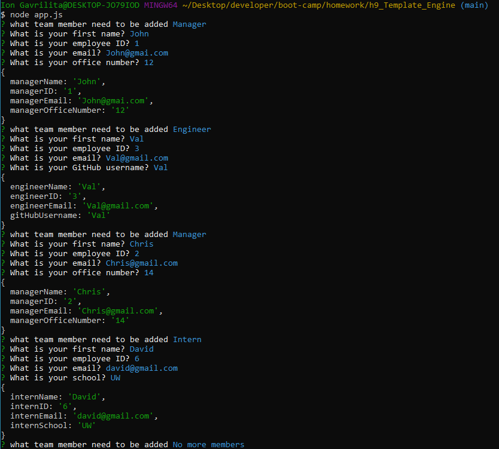
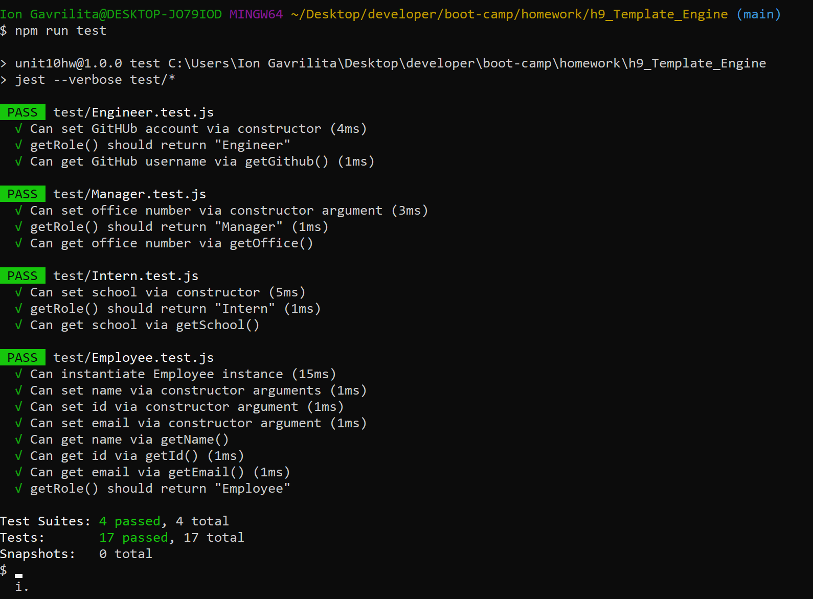

# Template Engine - Employee Summary
 Software engineering team generator command line application. The application will prompt the user for information about the team manager and then information about the team members. The user can input any number of team members, and they may be a mix of engineers and interns. This application pass all unit tests. When the user has completed building the team, the application will create an HTML file that displays a nicely formatted team roster based on the information provided by the user.
### Template Engine contents:

* [User Story](#User-Story)
* [Images with application functionality](#Images-with-application-functionality)
* [Tech/framework used](#Tech/framework-used)
* [Installation](#Installation)
* [Project Link & Repository](#Project-Link-&-Repository)
* [Contributors](#Contributors)
* [License](#License)

### User Story
```
As a manager
I want to generate a webpage that displays my team's basic info
so that I have quick access to emails and GitHub profiles
```
### Images with application functionality:

|  |  |  |

### Tech/framework used:
* Node JS

### Installation  
* Copy repository on your local machine
* Create a `.gitignore` file and include `node_modules/` and `.DS_Store/` so that your `node_modules` directory isn't tracked or uploaded to GitHub. Be sure to create your `.gitignore` file before installing any npm dependencies.
* Run npm install  in your terminal
* npm run test - to check if the app is working
* run node app.js - to start the app
* The application will prompt the user for information about the team manager and then information about the team members.
* When the user has completed building the team, the application will create an HTML file that displays a nicely formatted team roster based on the information provided by the user in output/team.html

### Project Link & Repository
- Functionality of the App Youtube Link- (https://www.youtube.com/watch?v=1pvLfz6tfCc&feature=youtu.be)
- Repository Link - (https://github.com/IonGavrilita/Node_Template_Engine)

### Contributors
* Name: Ion Gavrilita
- Email: gavrilita.ion.93@gmail.com
- Github profile: https://github.com/IonGavrilita
### License
This project is licensed under MIT
[](https://opensource.org/licenses/MIT)

